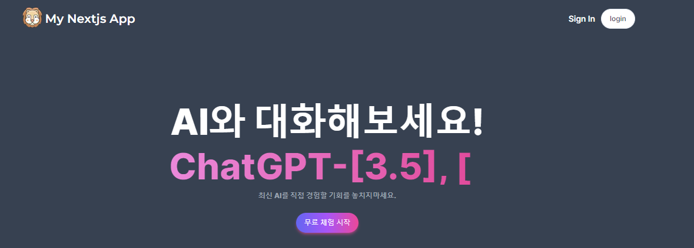
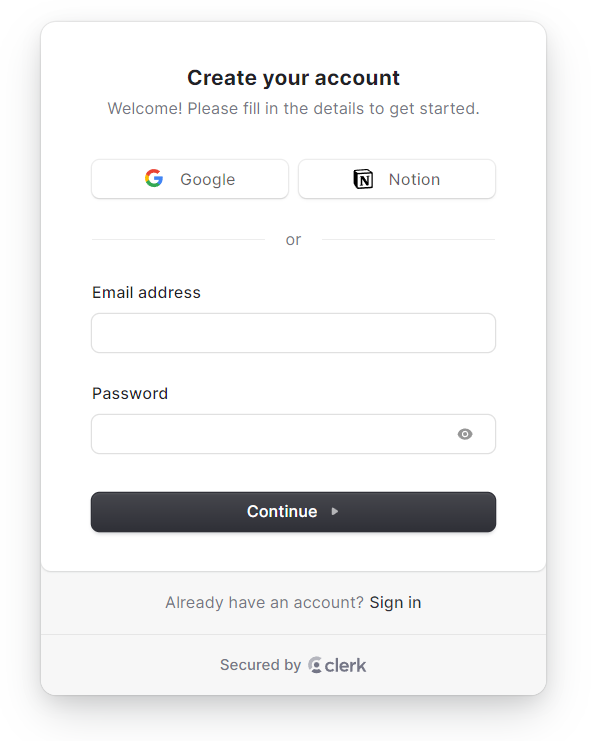
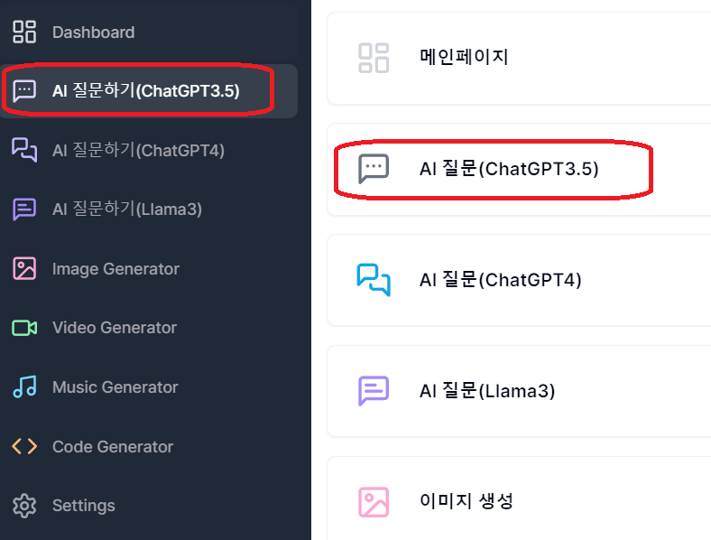
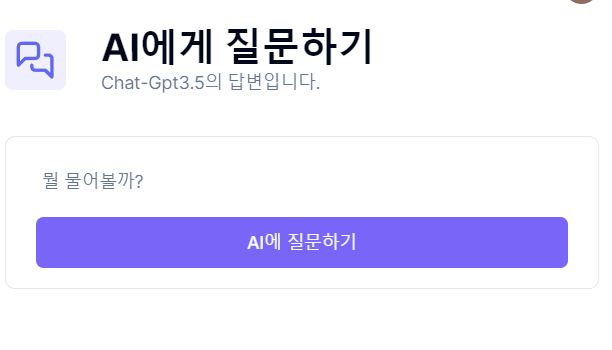
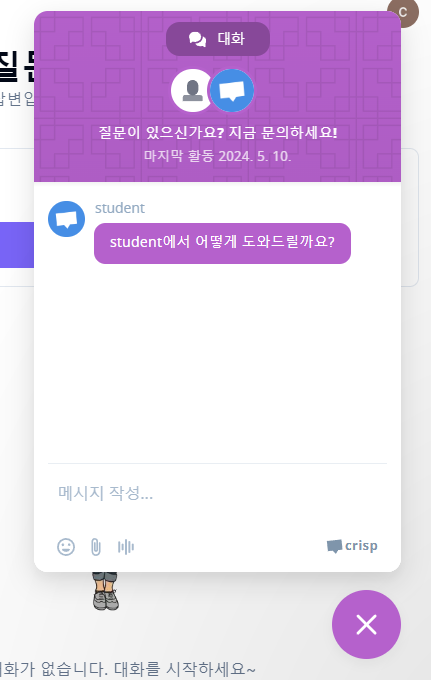
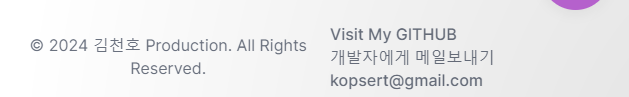
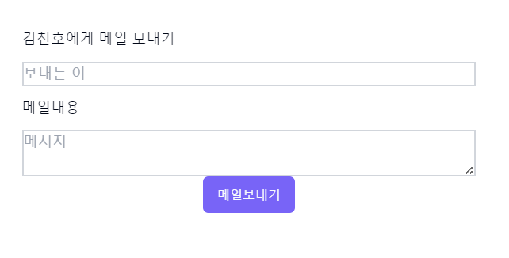

<!-- Improved compatibility of 최상단으로 link: See: https://github.com/othneildrew/Best-README-Template/pull/73 -->
<a name="readme-top"></a>
<!--
*** Thanks for checking out the Best-README-Template. If you have a suggestion
*** that would make this better, please fork the repo and create a pull request
*** or simply open an issue with the tag "enhancement".
*** Don't forget to give the project a star!
*** Thanks again! Now go create something AMAZING! :D
-->


<!-- PROJECT SHIELDS -->
<!--
*** I'm using markdown "reference style" links for readability.
*** Reference links are enclosed in brackets [ ] instead of parentheses ( ).
*** See the bottom of this document for the declaration of the reference variables
*** for contributors-url, forks-url, etc. This is an optional, concise syntax you may use.
*** https://www.markdownguide.org/basic-syntax/#reference-style-links
-->
[![Contributors][contributors-shield]][contributors-url]
[![Forks][forks-shield]][forks-url]
[![Stargazers][stars-shield]][stars-url]
[![Issues][issues-shield]][issues-url]
[![MIT License][license-shield]][license-url]
[![LinkedIn][linkedin-shield]][linkedin-url]


<!-- PROJECT LOGO -->
<br />
<div align="center">
  <a href="https://github.com/macklinkim/Nextjs-study-ai-saas">
    
  </a>

  <h3 align="center">최신 AI 쉽게 다가가기</h3>

  <p align="center">
    OPENAI GPT3.5, GPT4.0, Llama3, Dalle-3를 이용해보자 !
    <br />
    <a href="https://ai-saas-webstudy.vercel.app/"><strong>AI 사용하러 가기»</strong></a>
    <br />
    <br />
    <a href="https://github.com/macklinkim/Nextjs-study-ai-saas/issues/new?labels=bug&template=bug-report---.md">버그 신고</a>
    ·
    <a href="https://github.com/macklinkim/Nextjs-study-ai-saas/issues/new?labels=enhancement&template=feature-request---.md">기능 요청</a>
    ·
    <a href="https://blog.naver.com/kopsert">개발자블로그 방문</a>
    
  </p>
</div>


<!-- TABLE OF CONTENTS -->
<details>
  <summary>Table of Contents</summary>
  <ol>
    <li>
      <a href="#프로젝트-주제">프로젝트의 주제</a>
      <ul>
        <li><a href="#built-with">개발 환경</a></li>
      </ul>
    </li>
    <li>
      <a href="#시작하기">시작하기</a>
      <ul>
        <li><a href="#NPM-PACKAGES">필요 package</a></li>
        <li><a href="#installation">Installation</a></li>
      </ul>
    </li>
    <li><a href="#usage">Usage</a></li>
    <li><a href="#roadmap">Roadmap</a></li>
    <li><a href="#license">License</a></li>
    <li><a href="#contact">Contact</a></li>
    <li><a href="#acknowledgments">Acknowledgments</a></li>
  </ol>
</details>


<!-- ABOUT THE PROJECT -->
## 프로젝트-주제

[![Product Name Screen Shot][product-screenshot]](/public/captureMain.png)


https://github.com/macklinkim/Nextjs-study-ai-saas/assets/93594679/4da1f11d-0999-424c-bb18-ecaa7a88b7bc


최근 글로벌 거대기업들이 AI개발에 주력하고 있으며 세계는 이 변화를 주목하고 있습니다. 

이 프로젝트는 우수한 최신 AI의 기능을 일반 사용자에게 제공하는 AI SaaS 프로젝트입니다.

#### AI SaaS란?

AI SaaS(Software as a Service)란 클라우드 기반 방식으로 제공되는 인공지능 소프트웨어 서비스를 말합니다. 사전에 소프트웨어를 구매하거나 설치하지 않아도, 인터넷을 통해 필요할 때 언제든지 서비스를 사용할 수 있습니다. 

이 서비스는 대부분 월이나 연 단위로 사용료를 지불하는 형태로 운영되며, 서버 운영, 유지보수, 소프트웨어 업그레이드 등을 제공사가 담당하여 비용과 시간을 절약할 수 있습니다.

#### 왜 주제를 Nextjs, AI SaaS로?
* Nextjs는 fullstack 개발이 가능한 플렛폼으로 Frontend에 국한되지 않게 하나의 프로젝트에 front-backend 서비스를 개발하고 제공 할 수 있습니다.
* 최근 Llama3, GPT-4.0o 등의 발표로 AI 발전이 더 가속화됨을 느꼈고 이를 사용하지 않는다면 AI를 사용하는 개발자와 많은 차이가 있을 것이라 생각했습니다.
* 또한, 미래에 AI가 광범위하게 사용될 것이 자명하므로 api 사용방법을 익히기 위해 해당프로젝트를 주제로 선정하여 진행했습니다.
* 이외에 개인적으로 Nextjs와 React, Tailwind, Clerk 및 Openai API, Llama3, replicate 등의 AI기술에 접근하고 실제로 사용하는 프로젝트를 제작하고 싶어 주제로 정했습니다.
* 개발 과정에 공부하게 된 내용을 블로그에 정리했으니 방문해보세요.
  
<a href="https://blog.naver.com/kopsert">프로젝트 제작 블로그가기</a>
<br/>
<a href="https://www.youtube.com/watch?v=ffJ38dBzrlY&t=411s">참고 유튜브 영상(deplicated된 함수, layout, api등 코드 개선)</a>

<p align="right">(<a href="#readme-top">최상단으로</a>)</p>


### built-with
프로젝트에 사용한 주요 프레임워크와 라이브러리
##### web기술
NextJs와 React, Clerk
##### AI기술
OpenAI, Replicate

##### 클릭시 이동
* [![Next][Next.js]][Next-url]
* [![React][React.js]][React-url]
* [![openai][openai]][openai-url]
* [![Replicate][Replicate]][Replicate-url]
<p align="right">(<a href="#readme-top">최상단으로</a>)</p>


<!-- GETTING STARTED -->
## 시작하기

This is an example of how you may give instructions on setting up your project locally.
To get a local copy up and running follow these simple example steps.

### NPM-PACKAGES

이 프로젝트에는 다양한 library들을 사용했습니다.

* npm
  ```sh
  npm install "@clerk/nextjs"
    "@emailjs/browser"
    "@hookform/resolvers"
    "@prisma/client"
    "@radix-ui/react-avatar"
    "@radix-ui/react-dialog"
    "@radix-ui/react-label"
    "@radix-ui/react-progress"
    "@radix-ui/react-select"
    "@radix-ui/react-slot"
    "axios"
    "class-variance-authority"
    "clsx"
    "crisp-sdk-web"
    "emailjs"
    "lucide-react"
    "next"
    "openai"
    "react"
    "react-dom"
    "react-hook-form"
    "react-hot-toast"
    "react-markdown"
    "replicate"
    "stripe"
    "swiper"
    "tailwind-merge"
    "tailwindcss-animate"
    "typewriter-effect"
    "zod"
    "zustand"
  ```
*    "@emailjs/browser" : 개발자에게 메일 보내기
*    "@hookform/resolvers" : HookForm 사용(nextjs)
*    "@prisma/client" : prisma DB연결 및 관리
*    "@radix-ui/react-avatar" : AI 및 사용자 그림 표현
*    "@radix-ui/react-dialog" : 알림창
*    "@radix-ui/react-label"  : 라벨
*    "@radix-ui/react-progress" : 질문 횟수 소비 진행도
*    "@radix-ui/react-select" : AI그림생성 select tag
*    "@radix-ui/react-slot" : AI 그림생성 표현
*    "axios" : data fetch, server api 호출
*    "class-variance-authority" : 페이지 접근제어
*    "clsx" : tailwind css 병합
*    "crisp-sdk-web" : 실시간 문의데스크
*    "emailjs" : 개발자에게 Email보내기
*    "lucide-react" : 각종 아이콘
*    "next" : nextjs components 사용
*    "openai" : openai api gpt-3.5, gpt-4, dalle-2,3사용
*    "react" : react hooks 사용
*    "react-dom" : react hooks 사용
*    "react-hook-form" : react hooks 사용
*    "react-hot-toast" : 간편 안내경고 창
*    "react-markdown" : 코드영역 textarea
*    "replicate" : Llama3, 비디오생성 ai 
*    "stripe" : 카드결제용 라이브러리(테스트만)
*    "swiper" : 첫화면 3D slide
*    "tailwind-merge" : twmerge 사용
*    "tailwindcss-animate" : 에니메이션 효과적용
*    "typewriter-effect" : 첫화면 글자 타이핑 효과
*    "zod" : HookForm 사용시 validation
*    "zustand" : 글로벌 상태관리(구독 및 질의사용횟수)

### Installation

_아래는 앱을 설치하고 설정하는 방법의 예입니다. 제 AI SaaS 서비스는 OpenAI, Replica, Llama3, stripe... 등에 의존성을 가지며 각 서비스별 api_key를 획득하고 사용하는 것을 권장합니다._

1. 아래 문서를 참고하여 API Key들을 받으세요 (Stripe, Crisp는 별도 참고)
[emailjs](https://dashboard.emailjs.com/sign-in)
[OpenAi](https://blog.naver.com/kopsert/223435534517)
[Replica](https://blog.naver.com/kopsert/223441546630)
[CLERK](https://blog.naver.com/kopsert/223432983408)
[Prisma](https://blog.naver.com/kopsert/223441626528)

2. Clone git repocitory
   ```sh
   git clone https://github.com/your_username_/Project-Name.git
   ```
3. Install NPM packages
   ```sh
   npm install
   ```
4. API_Key 들을 복사된 `config.js`에 넣어주세요.
   ```js
   const API_KEY = 'ENTER YOUR API';
   ```

<p align="right">(<a href="#readme-top">최상단으로</a>)</p>


---
<!-- USAGE EXAMPLES -->
## Usage

사용법은 간단합니다. 아래 주소로 접속하시고
https://ai-saas-webstudy.vercel.app/

좌측상단 로그인버튼 클릭하시고 로그인하여 서비스를 이용하시면 됩니다.


로그인시 구글, Notion 으로 로그인하고


첫화면에서 원하는 서비스로 이동하고


질문입력란에 질문을 기재하고 버튼을 누르시거나 엔터치세요.


문제가 발생하면 보라색 말주머니 버튼 눌러 문의가능합니다.(crisp기능)


하단 footer에 메일 링크를 클릭하시고


개발자에게 바로 연락 가능하십니다.(emailjs)



<p align="right">(<a href="#readme-top">최상단으로</a>)</p>


<!-- ROADMAP -->
## Roadmap

- [x] Nextjs
- [x] OpenAI
  - [x] GPT-3.5
  - [x] GPT-4
  - [ ] GPT-4.0o
- [x] Llama3
- [x] Clerk
    - [ ] Clerk로 페이지 접근 제한(관리자페이지)
- [x] 사용법 문서화
- [ ] 다크모드 추가

제 github과 블로그에 방문하셔서 자세한 내용을 보실 수 있습니다. 
* [github](https://github.com/macklinkim/Nextjs-study-ai-saas/issues)
* [Blog](https://blog.naver.com/kopsert)

<p align="right">(<a href="#readme-top">최상단으로</a>)</p>


<!-- LICENSE -->
## License

Distributed under the MIT License. See `LICENSE.txt` for more information.

<p align="right">(<a href="#readme-top">최상단으로</a>)</p>


<!-- CONTACT -->
## Contact

김천호 - [EMAIL] - kopsert@naver.com
Project Link: [https://github.com/macklinkim/Nextjs-study-ai-saas](https://github.com/macklinkim/Nextjs-study-ai-saas)

<p align="right">(<a href="#readme-top">최상단으로</a>)</p>

<!-- MARKDOWN LINKS & IMAGES -->
<!-- https://www.markdownguide.org/basic-syntax/#reference-style-links -->
[contributors-shield]: https://img.shields.io/github/contributors/macklinkim/Nextjs-study-ai-saas.svg?style=for-the-badge
[contributors-url]: https://github.com/macklinkim/Nextjs-study-ai-saas
[forks-shield]: https://img.shields.io/github/forks/macklinkim/Nextjs-study-ai-saas.svg?style=for-the-badge
[forks-url]: https://github.com/macklinkim/Nextjs-study-ai-saas/network/members
[stars-shield]: https://img.shields.io/github/stars/macklinkim/Nextjs-study-ai-saas.svg?style=for-the-badge
[stars-url]: https://github.com/macklinkim/Nextjs-study-ai-saas/stargazers
[issues-shield]: https://img.shields.io/github/issues/macklinkim/Nextjs-study-ai-saas.svg?style=for-the-badge
[issues-url]: https://github.com/macklinkim/Nextjs-study-ai-saas/issues
[license-shield]: https://img.shields.io/github/license/macklinkim/Nextjs-study-ai-saas.svg?style=for-the-badge
[license-url]: https://github.com/macklinkim/Nextjs-study-ai-saas/blob/master/LICENSE.txt
[linkedin-shield]: https://img.shields.io/badge/-LinkedIn-black.svg?style=for-the-badge&logo=linkedin&colorB=555
[linkedin-url]: https://linkedin.com/in/othneildrew
[product-screenshot]: public/captureMain.png
[Next.js]: https://img.shields.io/badge/next.js-000000?style=for-the-badge&logo=nextdotjs&logoColor=white
[Next-url]: https://nextjs.org/
[React.js]: https://img.shields.io/badge/React-20232A?style=for-the-badge&logo=react&logoColor=61DAFB
[React-url]: https://reactjs.org/
[openai-url]: https://openai.com/
[openai]: public/openai.png
[Replicate-url]: https://replicate.com/
[Replicate]: public/replica.png
